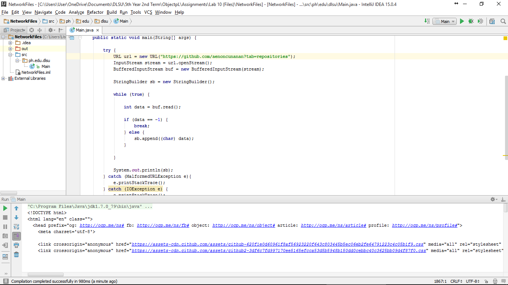

#NetworkFiles

Learning to access the xml file of a website.

#ScreenShot

#Code

~~~
package ph.edu.dlsu;

import java.io.BufferedInputStream;
import java.io.IOException;
import java.io.InputStream;
import java.net.MalformedURLException;
import java.net.URL;

public class Main {

    public static void main(String[] args) {

        try {
            URL url = new URL("https://github.com/aenoncunanan?tab=repositories");
            InputStream stream = url.openStream();
            BufferedInputStream buf = new BufferedInputStream(stream);

            StringBuilder sb = new StringBuilder();

            while (true) {

                int data = buf.read();

                if (data == -1) {
                    break;
                } else {
                    sb.append((char) data);
                }

            }

            System.out.println(sb);
        } catch (MalformedURLException e){
            e.printStackTrace();
        } catch (IOException e) {
            e.printStackTrace();
        }

    }
}
~~~
